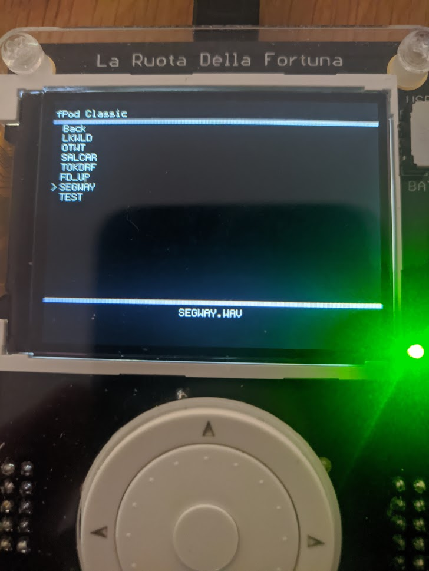

# fPodClassic

# Introduction 
The fPodClassic is a multi media program for the La Fortuna which is powered by an ATMEL AT90USB1286. The programs contains a easy to use GUI for the user to select songs and pictures.
# How to use
Songs and images must be saved onto the the SD Card. Sample songs and images are provided. 
How to add Songs:
+ Create a sub-folder in your SD card called songs
+ Download any songs you want to play
+ Install [Sox](http://sox.sourceforge.net/) if you do not have it installed already.
+ Convert them to 16KHz Mono 8-bit .WAV files using the "mono" shell script provided
+ Place songs into songs sub-folder

How to add images:
+ Create a sub-folder in your SD called pics
+ Download any images you want to view
+ Convert image to BMP16 file format
+ Place images into pics sub-folder

How to use program:

+ On the Main menu you may select either Songs, Pictures Or Options
+ Move selector arrow with the rotary encoder, make selection with center button
+ Song currently playing will be displayed at the bottom of the display (as seen in image)
+ To stop playback of song press the bottom button
+ To exit viewing of a picture press the left button

# Libraries used
+ [BMPedded](https://github.com/Spoffy/BMPedded)
+ [lafortuna-wav-lib](https://github.com/fatcookies/lafortuna-wav-lib)
+ [FatFs](http://elm-chan.org/fsw/ff/00index_e.html)
+ lcd library by Steve Gunn
+ [rios](http://www.cs.ucr.edu/~vahid/rios/rios_avr.htm) by Frank Vahid, Tony Givargis, and
   Bailey Miller modifed by Klaus-Peter Zauner
+ ruota by Peter Dannegger modifed by Klaus-Peter Zauner 
